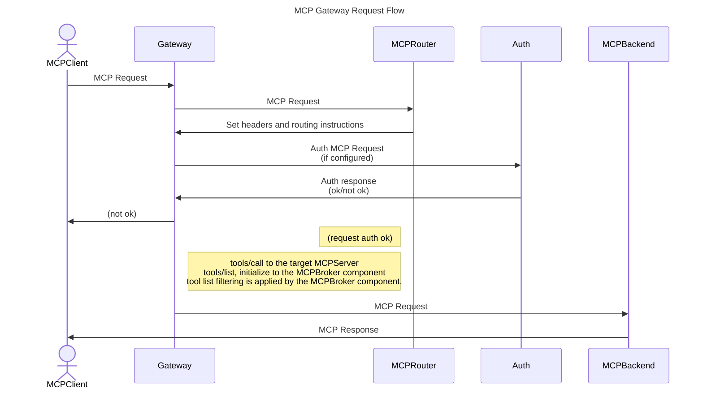
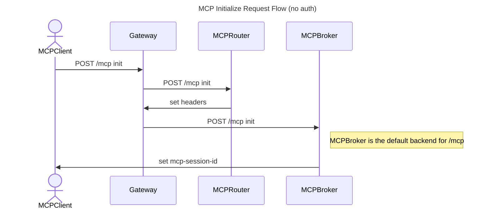
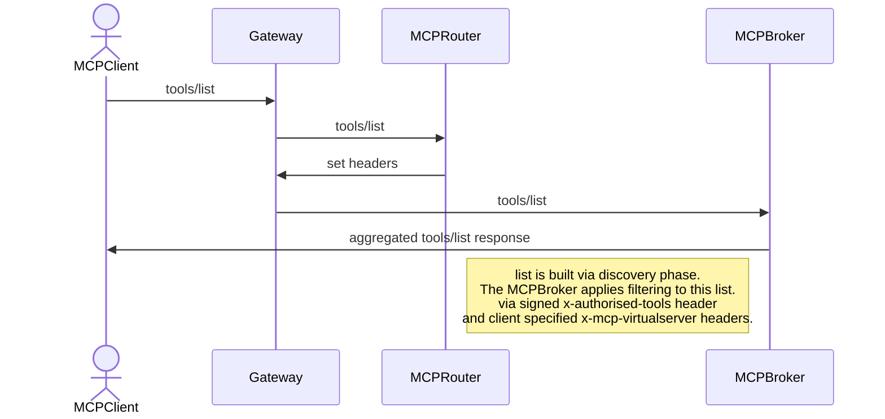
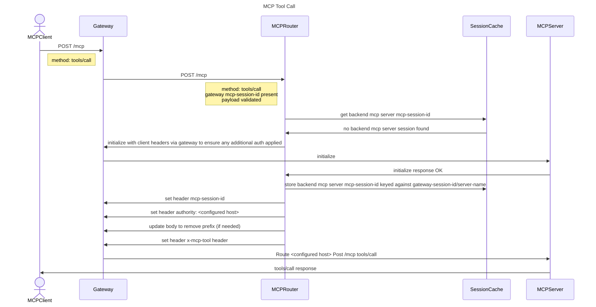
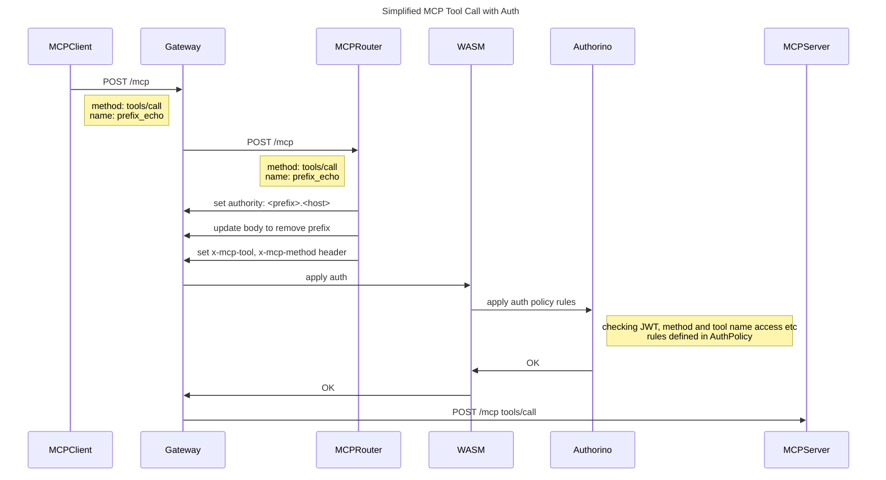
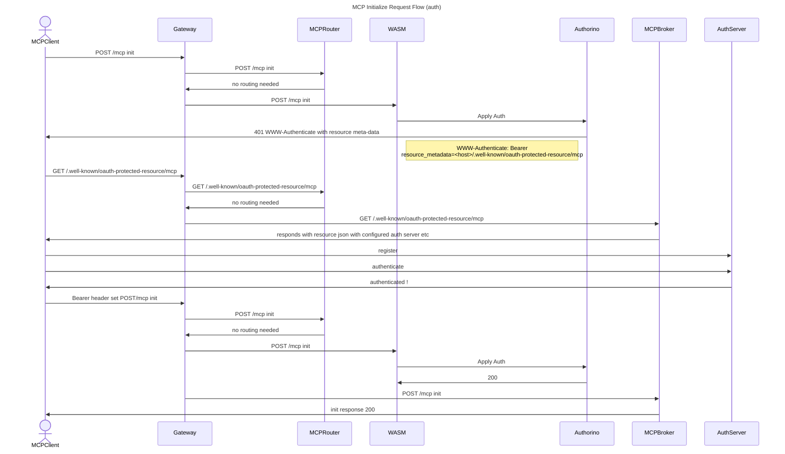
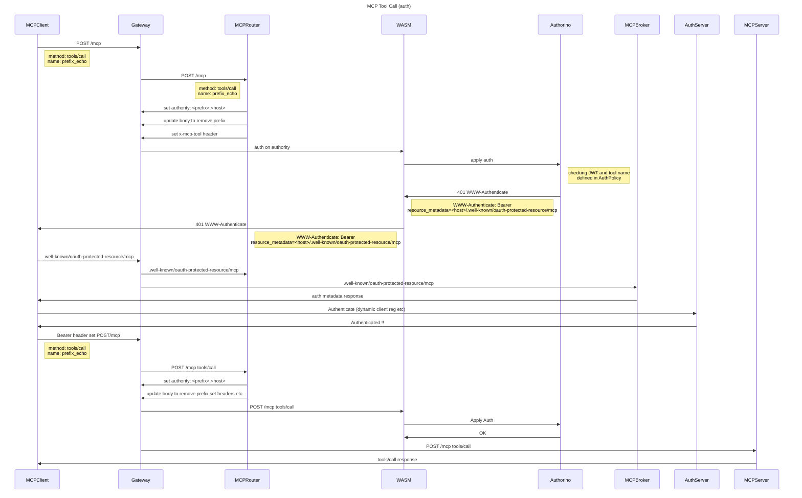

# MCP Gateway Request Flows

This document captures the main request flows that involve the MCP Gateway.

> note: Some show "no auth" this is to reduce noise and focus on the main flow through the gateway components.

## Table of Contents

- [Components](#components)
- [High Level Flow](#high-level-flows)
- [Initialize](#initialize)
- [Aggregated Tools/List](#aggregated-toolslist)
- [Tools/Call (no auth)](#toolscall-no-auth)
- [MCP Server Registration](#mcp-server-registration)
- [Auth](#auth)
  - [Tools/Call with auth (valid bearer token)](#toolscall-with-auth-valid-bearer-token)
  - [MCP Server Tool Call with Auth (Full auth flow)](#mcp-server-tool-call-with-auth-full-auth-flow)
- [MCP Notifications](#mcp-notifications)

## Components

| Component | Description |
|-----------|-------------|
| **Gateway** | Envoy proxy handling ingress traffic. Routes requests based on headers set by MCPRouter. |
| **MCPRouter** | Envoy external processor (ext_proc) that parses MCP requests, validates payloads, and sets routing headers (authority, x-mcp-tool, etc.). |
| **MCPBroker** | HTTP service that aggregates tools from multiple upstream MCP servers. Handles initialize and tools/list requests. |
| **MCPServer** | An upstream MCP server that provides tools. Receives tools/call requests routed by the Gateway. |
| **SessionCache** | In-memory or Redis based cache storing backend MCP server session IDs, keyed by gateway-session-id and server-name. |
| **WASM** | WebAssembly filter in Envoy that integrates with Authorino via Kuadrant for auth enforcement. |
| **Authorino** | Authentication and authorization service that validates JWTs and enforces AuthPolicy rules. |
| **AuthServer** | External OAuth/OIDC provider for client authentication. |

## High Level Flow

The flow below shows the common request flow with MCP Gateway. The MCPBackend represents either an actual MCPServer or the MCPBroker component. The type of request dictates which of these will be called in response to the MCP request.

## Initialize

## Aggregated Tools/List

Auth is removed in this diagram. Auth is shown in larger diagrams below.

## Tools/Call

## MCP Server Registration

For detailed information on how MCP server registration works, including the MCPManager lifecycle and configuration change handling, see the [backend MCP Management doc](./backend-mcp-management.md).

## Auth

Below are some attempts with Auth in the mix.

## MCP Gateway Request Authentication

### Tools/Call with auth (valid bearer token)

In the above diagram we are showing the flow when a client has a valid bearer token. Below we have the full flow including the OAuth dance:

## MCP Server Tool Call with Auth (Full auth flow)

## MCP Notifications

For detailed information on how notifications work in the MCP Gateway, see the [notifications design documentation](./notifications.md).
