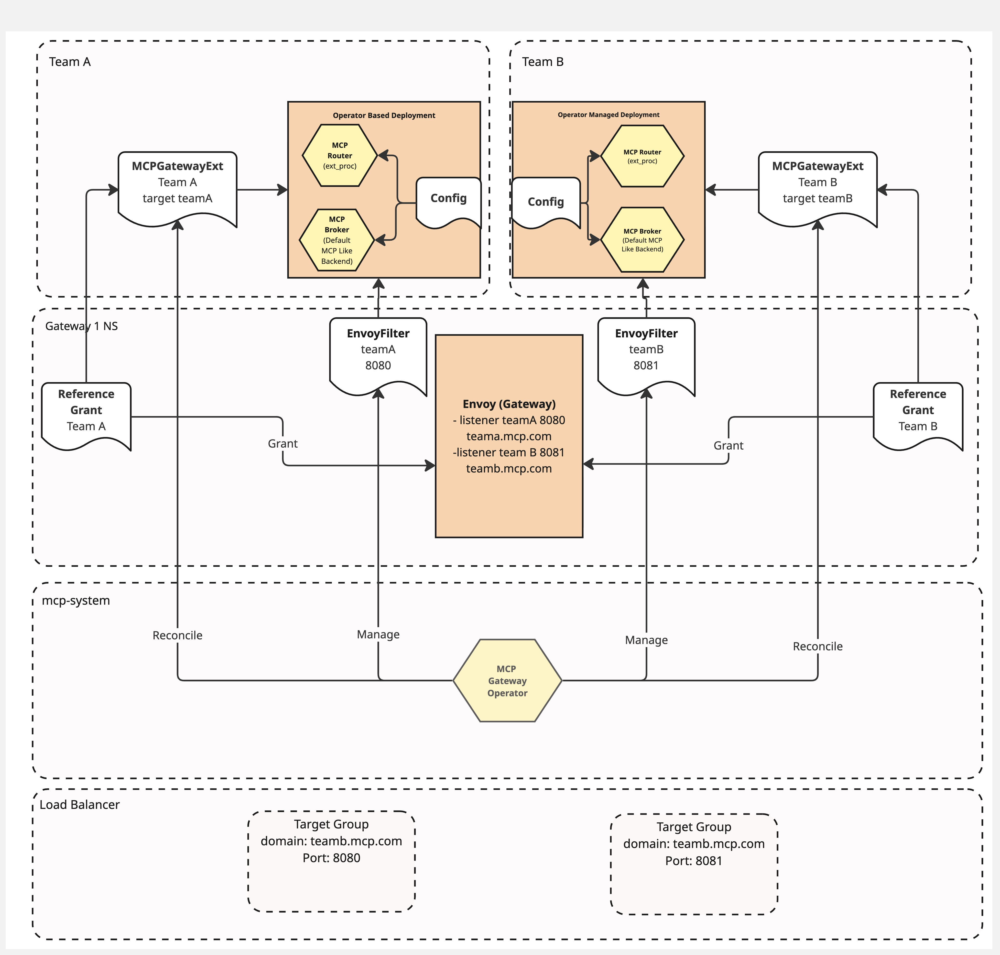

# Feature: Operator-based Deployment

## Summary

Operator-based deployment for MCP Gateway instances using MCPGatewayExtension as the operand. Automates setup, configuration, and lifecycle management of gateway instances with OLM compatibility. Builds on the design described in [isolated gateway deployment](./isolated-gateway-deployment.md).

## Goals

- Allow OLM based installation and upgrade
- Automate and simplify the setup of MCP Gateway Instance(s) and configuration
- Automate the uninstall of MCP Gateway Instance(s) and clean up of configuration
- Handle an MCPGatewayExtension becoming invalid
- Improve the user experience around exposing an MCP Server via the gateway

## Non-Goals

- Multi-cluster federation
- Automatic migration of existing MCPGatewayExtensions (manual guide provided)
- Resource/prompt federation (only tools currently supported)

## Design

### Backwards Compatibility

Existing MCPGatewayExtensions will become invalid until they are updated with a valid sectionName reference. We can provide a simple guide to change the targetRef.

### Architecture Changes

#### Packaging

Required is the packaging of the current controller into the correct OLM format and metadata (CatalogSource, Package Bundle etc). As the project is in a compatible kubebuilder structure and OLM uses kubebuilder, this packaging should not cause too many issues.

#### Deployment Model



The above diagram shows the namespace layout and resource structure of two teams sharing a single gateway.

### API Changes

#### MCPGatewayExtension Changes

We will use the existing `MCPGatewayExtension` resource as the operand for the operator. This resource allows targeting a gateway currently and decides which namespace configuration is allowed to be created in by the controller. The current state is that there can only be one listener on the gateway that acts as the entry point for MCP requests and so one MCPGatewayExtension per gateway.

As part of this work, we will add a requirement to set the `sectionName` property of the targetRef. So a valid target for the resource will now be a listener on a gateway.

```yaml
  targetRef:
    group: gateway.networking.k8s.io
    kind: Gateway
    name: mcp-gateway
    namespace: gateway-system
    sectionName: team-a-external
```

The addition of sectionName allows for the following improvements:

1) It will better inform the operator which listener port the ext_proc router should listen to for MCP requests, allowing the operator to manage the configuration of the EnvoyFilter directly rather than requiring the user to do it. This will reduce the potential for misconfiguration.
2) Allow the operator to discover additional configuration based on the gateway configuration and apply it to the router component, such as the public host to allow requests from removing the need for a user to set this manually.
3) Allow for a single gateway having multiple MCP Gateway listeners that can be used by independent MCP Gateway instances for individual development teams. Removing the need for multiple gateways and so reducing the deployment footprint and management overhead. (this would mean a shared Gateway but independent MCP Gateway Instances).

This change will mean you can have a gateway instance per unique port rather than per gateway. It will impact the MCPGatewayExtension reconciliation in the following way:

- It will no longer be invalid to target a single gateway with multiple MCPGatewayExtensions. It will become invalid to have multiple extensions target listeners that share a port number.
- During the reconcile the port for the targeted listener will be read. Valid MCP configuration for a gateway instance targeting that listener will be based on the listener configuration (port number and hostnames).

#### Example Configuration

Below is an example Gateway, HTTPRoutes and MCPGatewayExtension for team-a: (note for brevity team-b resources are excluded but effectively duplicate team-a resource except for the targetRef)

```yaml
#gateway spec
spec:
  gatewayClassName: istio
  listeners:
  - allowedRoutes:
      namespaces:
        from: team-a
    hostname: team-a.127-0-0-1.sslip.io #public host to expect request on in the router. A wildcard will default to mcp.<hostname>.
    name: team-a-external
    port: 8080 #Envoy Listener Port for the router to intercept on
    protocol: HTTP
  - allowedRoutes:
      namespaces:
        from: team-a #ensures only team-a can attach routes
    hostname: '*.team-a.mcp.local' #this hostname is used to identify which HTTPRoutes are attached to this listener
    name: team-a
    port: 8080 #internal routing domain with matching listener port to the targeted listener
    protocol: HTTP
  - allowedRoutes:
      namespaces:
        from: team-b #ensures only team-b can attach routes
    hostname: team-b.127-0-0-1.sslip.io
    name: team-b-external
    port: 8081
    protocol: HTTP
  - allowedRoutes:
      namespaces:
        from: team-b
    hostname: '*.team-b.mcp.local' #this hostname is used to identify which HTTPRoutes are attached to this listener
    name: team-b
    port: 8081 #internal routing domain with matching listener port
    protocol: HTTP

#HTTPRoute(s) Spec
metadata:
  name: team-a-external
  namespace: team-a
spec:
  hostnames:
  - team-a.127-0-0-1.sslip.io
  parentRefs:
  - group: gateway.networking.k8s.io
    kind: Gateway
    name: mcp-gateway
    namespace: gateway-system
    sectionName: team-a-external
---
metadata:
  name: team-a-server1
  namespace: team-a
spec:
  hostnames:
  - server1.team-a.mcp.local
  parentRefs:
  - group: gateway.networking.k8s.io
    kind: Gateway
    name: mcp-gateway
    namespace: gateway-system
    sectionName: team-a
---
... same for team-b different host and section  name
---
#MCPGatewayExtension
metadata:
  name: team-a-mcp-gateway
  namespace: team-a
spec:
  targetRef:
    group: gateway.networking.k8s.io
    kind: Gateway
    name: mcp-gateway
    namespace: gateway-system
    sectionName: team-a-external #ties this instance to port 8080
```

#### Optional Spec Fields

Some flags will also be able to be set via the `MCPGatewayExtension` resource if needed:

```yaml
spec:
  wildcardSubDomain: kuadrant
  trustedHeadersKey: # will trigger mount of secret into gateway
    secret:
      name: trusted-headers-key
    generate: true
```

### Component Changes

#### Reconciliation of a Valid MCPGatewayExtension

For the most part the existing reconciliation of the MCPGatewayExtensions will remain the same. It will continue to inform what namespace and which MCP routing configuration should be created/deleted for a given gateway instance. A valid MCPGatewayExtension will change from one that targets a gateway to one that targets a unique listener with a unique port (one per listener). Conflict will be dealt with as described in [isolated gateway deployment](./isolated-gateway-deployment.md).

New logic will be added to the existing controller to take the following actions when a MCPGatewayExtension is reconciled:

- The deployment, service and main HTTPRoute for MCP Server access via the gateway will now be created and managed by the operator. The HTTPRoute will be created based on the targeted listener hostname. If it is a wildcard host, we will use the subdomain "mcp" by default. If it is not a wildcard the hostname in the HTTPRoute will match the hostname in the listener exactly.
- The operator will discover the public host and set the router flag `--mcp-gateway-public-host` used to ensure no host header modification. This host will match the HTTPRoute host.
- Auto set the private host flag `--mcp-gateway-private-host` this will be set to the service name of the gateway and allows hair pinning of initialize requests back through the gateway when a tool/call is made (existing behaviour).
- Generate a unique internal key for hair pinning requests via the flag `--mcp-router-key` that is used to authenticate the internal hair pinning request is from the same gateway.
- Generate the EnvoyFilter and apply it to the correct gateway and port
- (optional) Generate a key pair for supporting the trusted-header signing. [see](../guides/user-based-tool-filter.md)

#### What Happens When an MCPGatewayExtension Becomes Invalid

If an admin changes or deletes a reference grant, listener or the gateway, the MCPGatewayExtension will be marked as invalid. When an MCPGatewayExtension becomes invalid, the operator will take the following actions:

- Remove any config from the namespace
- Remove the EnvoyFilter associated with that MCPGatewayExtension
- Remove the Gateway HTTPRoute

This will stop the router being able to route requests (no config) and stop the router and broker from receiving any more traffic.

#### Status Updates

We currently update the status of the HTTPRoute. We will extend this to update the listener status with a condition also. The idea here is to provide information to the gateway owner.

```yaml
      - lastTransitionTime: "2026-02-05T09:25:25Z"
        message: "listener in use by MCP Gateway: team-a/mcp-gateway EnvoyFilter: istio-system/team-a"
        observedGeneration: 1
        reason: Programmed
        status: "True"
        type: MCPGatewayExtension
```

### Security Considerations

#### EnvoyFilter Creation

Until this point the EnvoyFilter and the public Gateway HTTPRoute had to be created manually by a privileged user. With this proposal, the creation of a **valid** MCPGatewayExtension will now trigger the creation of an EnvoyFilter and HTTPRoute that will modify the target gateway configuration and send traffic to the deployed MCP Gateway Router and setup a route to the MCP Gateway Broker. This is a highly privileged action. So before the operator creates an EnvoyFilter applying the ext_proc configuration to a port or the HTTProute to expose the gateway, it will check that the targeted listener allows HTTPRoutes to be created from the same namespace as the MCPGatewayExtension it is reconciling. As attaching a route to this listener allows for traffic to be routed this is enough to allow the operator to setup the route and EnvoyFilter for that listener to send traffic to the broker and router. It is up to the platform / gateway admin to ensure the listeners are setup correctly. If the configuration changes and to something disallowing route creation and the operator has created these resources previously, they will be removed.

#### Shared Gateway

As this proposed change will allow teams to share a common ingress gateway, there is a possibility of a team, as long as an admin had created the reference grant, creating an MCPGatewayExtension that targets a different listener. This can be stopped by correct configuration. In the example above each listener has a `allowedRoutes` section, the controller will use this to decide whether the MCPGatewayExtension has a valid target or not. So the namespace where the MCPGatewayExtension is created must be one of the allowed namespaces specified in the target listener.

## Implementation Plan

1. Add sectionName requirement to MCPGatewayExtension CRD
2. Update controller to read listener port from targetRef
3. Implement deployment/service/HTTPRoute creation in reconciler
4. Implement EnvoyFilter generation
5. Add invalid MCPGatewayExtension handling (cleanup)
6. Update status reporting on Gateway listeners
7. Package for OLM

## Testing Strategy

- Unit tests: reconciler logic, validation, resource generation
- Integration tests: MCPGatewayExtension lifecycle with envtest
- E2E tests: full deployment flow, external clients, multi-team gateway sharing, invalid and valid extensions

## Open Questions

- None currently

## Execution

### Todo
- [ ] Generate OLM bundle (CatalogSource, Package, Bundle metadata)
- [ ] Add listener status condition updates
- [ ] Add trusted-header key pair generation (optional feature)
- [ ] Update documentation for sectionName requirement
- [ ] Create migration guide for existing MCPGatewayExtensions
- [ ] Add sectionName to MCPGatewayExtension targetRef
- [ ] Update controller to read listener configuration
- [ ] Implement HTTPRoute creation for gateway access

### Completed
- [x] Add MCPGatewayExtension reconcile (status, validation and resource creation)
- [x] Add MCPGatewayExtension deletion handling (cleanup)
- [x] Implement deployment/service resource creation in MCPGatewayExtension reconciler
- [x] Implement EnvoyFilter generation in MCPGatewayExtension reconciler
- [x] Create e2e tests and infrastructure
- [x] Update helm templates to reflect the new operator deployment
