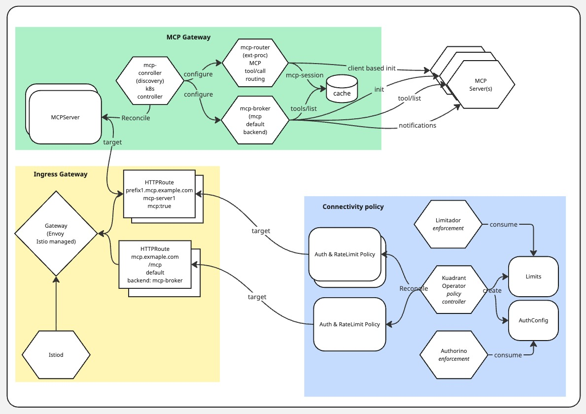

## MCP Gateway Arch Overview

> Note this is swiftly evolving project. It is likely this doc will fall behind reality to some extent.

### Overview

MCP Gateway looks to build on top of the routing capabilities of Envoy with capabilities to handle the Model Context protocol. 

### Vision

Provide an Envoy based integration that allows teams and platform engineers to be able to operate and collaborate to expose MCP servers via a gateway as secure and protected services just as they do with existing RESTFul based APIs.

**Design Constraints**

- Work with Gateway API as a routing configuration
- Allow Envoy to control routing and traffic
- Focus MCP Gateway on the MCP Protocol and enabling Envoy to route this traffic
- Be able to leverage Istio as the Gateway Control Plane in kube environments
- Allow other integrations to provide key features such as Auth and RateLimiting (e.g Kuadrant)
- Allow in the future for the move of some functionality (likely the router) towards WASM or a Dynamic module

**High Level Overview**

## Components

### MCP Router

**Overview:**

The MCP router is an envoy focused ext_proc component that is capable of parsing the MCP protocol and using it to set headers to force correct routing of the request to the correct MCP server. It is mostly involved with specific tools call requests.

**Responsibilities:**

- Parsing and validation of the MCP [JSON-RPC](https://www.jsonrpc.org/) body
- Setting the key request headers: 
    - x-destination-mcp, x-mcp-tool, mcp-session-id
- Watching for 404 responses from MCP servers and invalidating the  session store.
- Handling session initialization and storage on behalf of a requesting  MCP client during a tools/call

### MCP Broker

**Overview:**

The MCP Broker is a backend service configured with other MCP servers that acts as a default MCP server backend for the /mcp endpoint.

**Responsibilities**:

- General MCP Backend 
- Acts as a client to discovered MCP servers (init, tools/list, notifications)
- Handles the external client init call and responding with the baseline capabilities, version and service info
- Brokering SSE notifications between client and MCP server
- Creating the aggregated tools/list call
- Validating discovered MCP Servers meet minimum requirements (protocol version and capabilities) before including their tools in the list
- Handle notification requests from clients and MCP Servers (proxying from the MCP server notification to registered clients)

### MCP Discovery Controller

**Overview**

The MCP Discovery Controller is a Kubernetes-based controller that will watch for resources and discover new MCP servers to form configuration for the other components.

**Responsibilities:**

- Watching MCPServer resources labelled as MCP routes
- Maintaining a config from the HTTPRoute and the MCPServer resources
- Updating the MCP Broker and MCP Router config (configmap) based on discovered MCPServer resources and the HTTPRoutes it targets.
- Reporting status of MCPServers

### Request Flows

> Note: these diagrams are also being iterated on rapidly

[sequence diagrams](./flows.md)